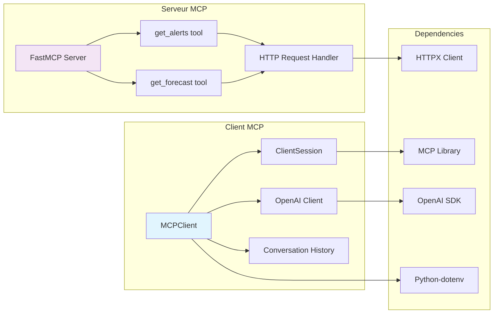
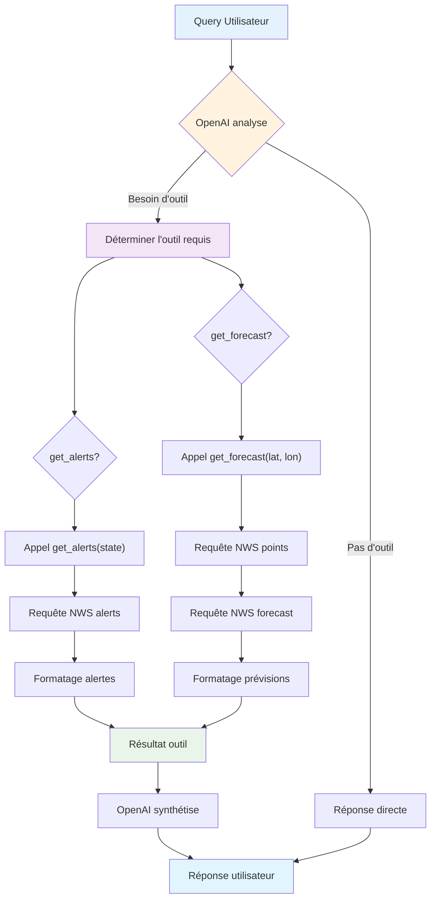
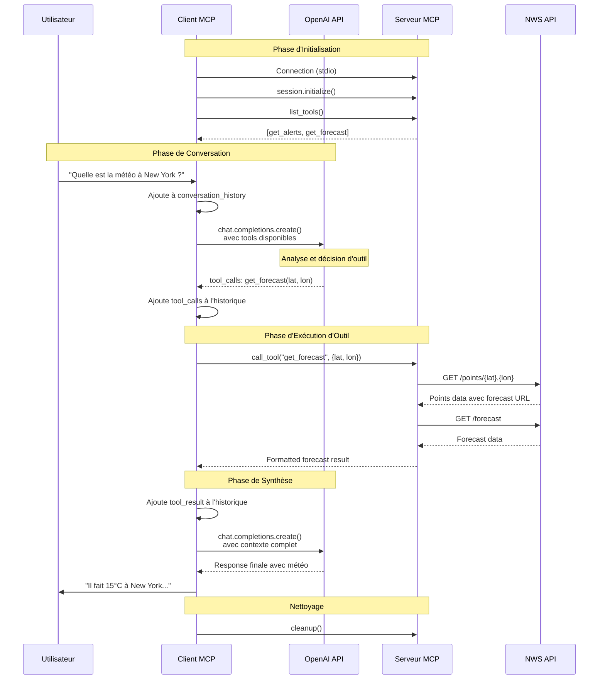

# Quickstart Resources

Repository with Model Context Protocol (MCP) projects:
- MCP client with OpenAI integration
- MCP weather server

## Installation et Utilisation

Ce projet utilise **uv** pour la gestion des dépendances avec des environnements virtuels isolés par projet.

### Installation des dépendances
```bash
# Pour chaque projet individuellement
cd mcp-client-python
sudo uv sync

cd ../weather-server-python  
sudo uv sync
```

### Configuration

#### Client MCP (OpenAI)
```bash
cd mcp-client-python
# Configuration
cp .env.example .env
# Éditer .env pour ajouter votre OPENAI_API_KEY

# Lancement du client
uv run python client.py ../weather-server-python/weather.py
```

#### Serveur MCP Météo
```bash
cd weather-server-python
# Configuration
cp .env.example .env
# Éditer .env pour ajouter votre clé API météo

# Lancement du serveur
uv run python weather.py
```

## Gestion de l'Environnement

### uv par projet
Chaque projet utilise son propre environnement virtuel isolé :
- **Installation** : `uv sync` dans le dossier du projet crée un environnement virtuel local
- **Exécution** : `uv run <commande>` utilise l'environnement virtuel du projet courant
- **Environnement virtuel** : Créé automatiquement dans `.venv` dans chaque dossier de projet
- **Nettoyage** : `rm -rf .venv` pour supprimer l'environnement du projet

### Commandes utiles
```bash
# Depuis le dossier d'un projet
cd mcp-client-python
uv sync                    # Installer les dépendances
uv run python -c "import openai; print('OpenAI OK')"  # Vérifier l'installation

cd ../weather-server-python
uv sync                    # Installer les dépendances  
uv run python -c "import httpx; print('HTTPX OK')"  # Vérifier l'installation

# Mettre à jour une dépendance
cd mcp-client-python
uv add openai               # Ajouter/mettre à jour openai
```

## Structure du Projet

```
quickstart-resources/
├── mcp-client-python/          # Client MCP avec OpenAI
│   ├── .venv/                  # Environnement virtuel du client
│   ├── client.py
│   ├── .env.example
│   └── pyproject.toml
└── weather-server-python/      # Serveur MCP météo
    ├── .venv/                  # Environnement virtuel du serveur
    ├── weather.py
    ├── .env.example
    └── pyproject.toml
```

Chaque projet est totalement indépendant avec son propre environnement virtuel et ses propres dépendances.

## Architecture du Projet


### Structure des Composants

Ce diagramme détaille l'architecture interne des composants MCP. Le côté client montre la classe MCPClient qui orchestre la ClientSession pour la communication MCP, l'OpenAI Client pour les appels IA, et maintient l'historique de conversation. Du côté serveur, FastMCP gère l'enregistrement des outils get_alerts et get_forecast, qui utilisent HTTP Request Handler pour communiquer avec l'API externe. Les dépendances incluent les bibliothèques MCP pour le protocole, HTTPX pour les requêtes HTTP, OpenAI SDK pour l'intégration IA, et python-dotenv pour la gestion des variables d'environnement.



### Flow de Décision MCP

Ce flowchart représente la logique de décision d'OpenAI lorsqu'il traite une requête utilisateur. OpenAI analyse d'abord la requête pour déterminer si un outil est nécessaire. Si aucun outil n'est requis, il fournit une réponse directe. Si un outil est nécessaire, il détermine lequel des deux outils météo utiliser : get_alerts pour les alertes par état, ou get_forecast pour les prévisions par coordonnées. Chaque outil déclenche des requêtes spécifiques à l'API NWS (alerts, points, ou forecast), puis les données sont formatées et renvoyées à OpenAI pour synthèse avant la réponse finale à l'utilisateur.




## Flux des Appels MCP

### Diagramme de Séquence Complet

Ce diagramme de séquence illustre le flux complet d'une requête MCP, divisé en quatre phases principales. La phase d'initialisation établit la connexion entre client et serveur via stdio et découvre les outils disponibles. La phase de conversation capture la requête utilisateur et l'envoie à OpenAI avec les outils disponibles. La phase d'exécution d'outil déclenche quand OpenAI détermine qu'un outil est nécessaire : le client appelle le serveur MCP, qui effectue les requêtes HTTP vers l'API NWS (d'abord pour obtenir les points de grille, puis les prévisions). La phase de synthèse intègre les résultats de l'outil dans le contexte OpenAI pour générer une réponse finale contextuelle.




## Détails des Composants MCP

### Client MCP Features
- **Session Management** : Gestion des connexions stdio avec les serveurs
- **Tool Discovery** : Découverte automatique des outils disponibles
- **OpenAI Integration** : Conversion des outils MCP en format OpenAI functions
- **Conversation History** : Maintien du contexte de conversation
- **Error Handling** : Gestion robuste des erreurs

### Serveur MCP Features
- **FastMCP Framework** : Utilisation du framework FastMCP pour le développement rapide
- **Tool Registration** : Décoration des fonctions avec `@mcp.tool()`
- **Async Operations** : Support des opérations asynchrones
- **API Integration** : Intégration avec l'API National Weather Service
- **Data Formatting** : Formatage des réponses pour une meilleure lisibilité

### Protocole MCP
- **Transport** : Communication via stdio (standard input/output)
- **Message Format** : JSON-RPC 2.0 pour les échanges
- **Tool Calling** : Mécanisme standardisé pour l'appel d'outils
- **Resource Sharing** : Partage de ressources entre client et serveur
